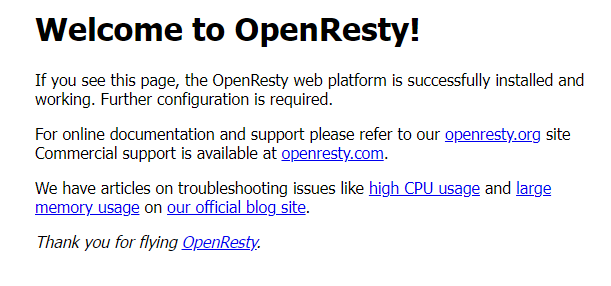
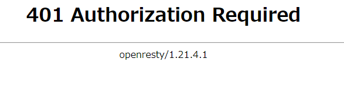

# openresty-ldap-auth

OpenResty+openldap+ngx_auth_modでLdap認証と認可を試みる。


# セットアップ

## ソースダウンロード

```bash
git clone https://github.com/v1tam1nb2/openresty-ldap-auth.git
```

## ビルド

```bash
cd openresty-ldap-auth
docker-compose build
```

## コンテナ起動

```bash
docker-compose up -d
```

## Ldapテストユーザー追加

パスワードはすべて`givenName`と同じにしている。（例：test001ユーザーのパスワードはtest001）

```ldif
dn: cn=test001,dc=my-company,dc=com
givenName:test001
sn:test001
cn:test001
mail:test001@my-company.com
userPassword::dGVzdDAwMQ==
objectClass: inetOrgPerson
objectClass: top

dn: cn=test002,dc=my-company,dc=com
givenName:test002
sn:test002
cn:test002
mail:test002@my-company.com
userPassword::dGVzdDAwMg==
objectClass: inetOrgPerson
objectClass: top

dn: cn=test003,dc=my-company,dc=com
givenName:test003
sn:test003
cn:test003
mail:test003@my-company.com
userPassword::dGVzdDAwMw==
objectClass: inetOrgPerson
objectClass: top

dn: cn=test004,dc=my-company,dc=com
givenName:test004
sn:test004
cn:test004
mail:test004@my-company.com
userPassword::dGVzdDAwNA==
objectClass: inetOrgPerson
objectClass: top

dn: cn=test005,dc=my-company,dc=com
givenName:test005
sn:test005
cn:test005
mail:test005@my-company.com
userPassword::dGVzdDAwNQ==
objectClass: inetOrgPerson
objectClass: top
```

```bash
docker exec ldap-server ldapadd -x -D "cn=admin,dc=my-company,dc=com" -w admin -f /openldap/testuser.ldif -ZZ
```


## phpLDAPadminにアクセス

Ldapの情報をブラウザから確認できるサービス。以下の情報でログインできる。

ここからユーザー登録なども行える。

```
Login DN: cn=admin,dc=my-company,dc=com
Password: admin
```

## ngx_auth_modの設定

各パラメータについては以下を参照。

- [ngx_ldap_auth](https://github.com/iij/ngx_auth_mod/blob/master/docs_ja/ngx_ldap_auth.md)

```conf
socket_type = "tcp"
socket_path = "0.0.0.0:9200"
#cache_seconds = 0
#use_etag = true
auth_realm = "TEST Authentication"

# コンテナサービス名でホストを指定
host_url = "ldaps://ldap-server"
start_tls = 0
skip_cert_verify = 1
# root_ca_files = [
# 	"/etc/ssl/certs/Local-CA-Chain.cer",
# ]

base_dn = "DC=my-company,DC=com"
bind_dn = "CN=%s,DC=my-company,DC=com"
#uniq_filter = "(memberOf=CN=%s,DC=my-company,DC=com)"
timeout = 5000
```

## 認可用Luaスクリプト

test001ユーザー以外はログインできないようにしてみた。

```lua
-- remote user名を取得
local remote_user = ngx.var.remote_user
if remote_user ~= "test001" then
    -- test001ユーザーでなければ401
    ngx.header.content_type = "text/plain"
    ngx.log(ngx.STDERR, remote_user.." にはアクセス権がありません")
    ngx.status = ngx.HTTP_UNAUTHORIZED
    return ngx.exit(ngx.status)
end
```

# アクセス確認

- http://localhost

## test001ユーザーでログイン




## test001ユーザー以外でログイン



# OpenRestyのログ

```
192.168.96.1 - - [25/Mar/2023:02:17:27 +0000] "GET / HTTP/1.1" 401 587 "-" "Mozilla/5.0 (Windows NT 10.0; Win64; x64) AppleWebKit/537.36 (KHTML, like Gecko) Chrome/111.0.0.0 Safari/537.36 Edg/111.0.1661.51"
192.168.96.1 - test001 [25/Mar/2023:02:17:32 +0000] "GET / HTTP/1.1" 200 1097 "-" "Mozilla/5.0 (Windows NT 10.0; Win64; x64) AppleWebKit/537.36 (KHTML, like Gecko) Chrome/111.0.0.0 Safari/537.36 Edg/111.0.1661.51"
192.168.96.1 - - [25/Mar/2023:02:19:31 +0000] "GET / HTTP/1.1" 401 587 "-" "Mozilla/5.0 (Windows NT 10.0; Win64; x64) AppleWebKit/537.36 (KHTML, like Gecko) Chrome/111.0.0.0 Safari/537.36 Edg/111.0.1661.51"
2023/03/25 02:19:36 [] 8#8: *5 [lua] auth.lua:6: test002 にはアクセス権がありません while sending to client, client: 192.168.96.1, server: localhost, request: "GET / HTTP/1.1", host: "localhost"
192.168.96.1 - test002 [25/Mar/2023:02:19:36 +0000] "GET / HTTP/1.1" 401 587 "-" "Mozilla/5.0 (Windows NT 10.0; Win64; x64) AppleWebKit/537.36 (KHTML, like Gecko) Chrome/111.0.0.0 Safari/537.36 Edg/111.0.1661.51"
```

# 参考

- [Download and install](https://go.dev/doc/install)

- [ngx_auth_mod Getting Started](https://github.com/iij/ngx_auth_mod/blob/master/docs_ja/GettingStarted.md)

- [KnowledgeでOpenLDAP連携](https://zenn.dev/mebiusbox/articles/a1f2ca3965bbb3)
